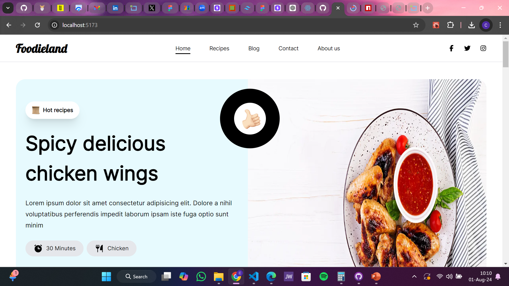
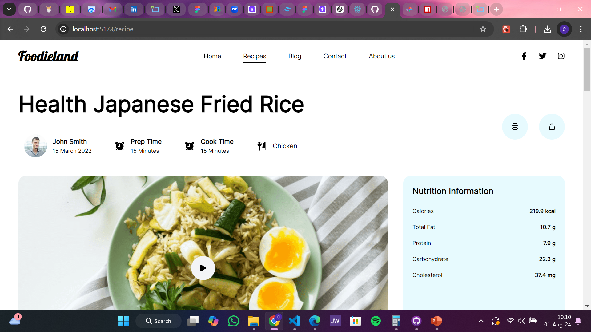

# Foodieland - Tobams Group Frontend Role Assessment

This is a solution to the assessment given to me by Tobams group for the Frontend intern role

## Table of contents

- [Overview](#overview)
  - [Project Requirement](#project-requirement)
  - [Screenshot](#screenshot)
  - [Links](#links)
  - [Built with](#built-with)

## Overview

### Project Requirement

   **# 1. Technology Stack:**
      ○ TypeScript (required)
      ○ React
      ○ Next.js (preferable but not mandatory)

   **# 2. Design:**
      ○ You are provided with a Figma link containing the design of the webpage below. Ensure your implementation matches the design as closely as possible.

   **# 3. Functionality:**
      ○ The webpage should be responsive and work seamlessly on both desktop (mobile responsiveness not mandatory).
      ○ Implement all interactive elements as specified in the Figma design.
      ○ Ensure that the webpage is accessible and follows best practices for web development.

   **# 4. Code Quality:**
      ○ Write clean, maintainable, and well-documented code.
      ○ Follow industry best practices for code structure and organisation.
      ○ Use Git for version control. Make regular commits with clear messages.

   **# 5. Performance:**
      ○ Optimise the webpage for fast loading times.
      ○ Minimise the use of heavy libraries and optimise images.

   **# 6. Testing:**
      ○ Write unit tests for critical components.
      ○ Ensure the application is free of major bugs and issues.

### Screenshots

### Links

- Solution URL: (https://github.com/Chima-Peter/Foodieland)
- Live Site URL: (https://chima-peter.github.io/Foodieland)

### Built with

- [React](https://reactjs.org/) - JS library
- Tailwind CSS
- TypeScript
